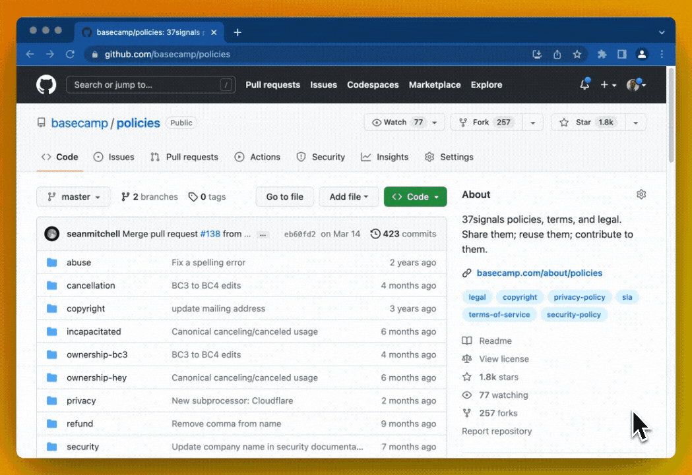

# Sign up to receive update notifications

You can subscribe to activity notifications to know when our policies change. Here's how:

1. Go to [GitHub.com](https://github.com/) and sign in with your account. You can create a free account if you don't have one.
2. Visit our Policies repository at [https://github.com/basecamp/policies](https://github.com/basecamp/policies).
3. Click the "Watch" button at the top right corner of the page.
4. Choose the notification settings you want. If you want to keep things simple, just select "All Activity."

That's it! You'll get notifications for any activity that happens in that repository. You can change your notification settings or stop getting notifications by clicking the "Watch" button again.
